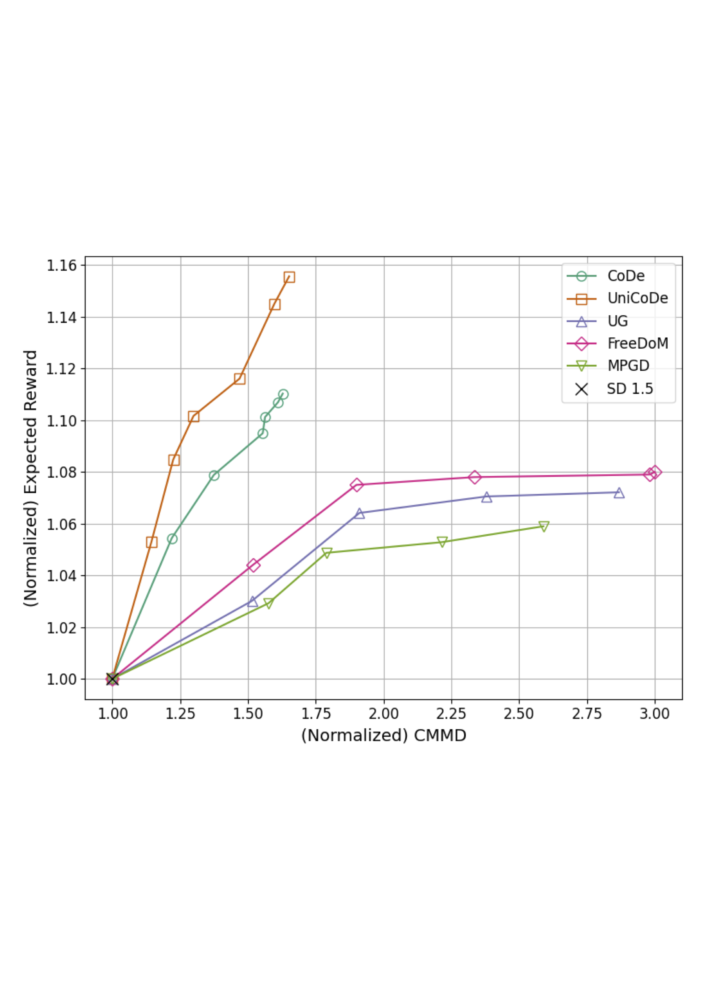

# UniCoDe: Unified Control for Inference-Time Guidance of Denoising Diffusion Models

[arXiv Link] (http://arxiv.org/abs/2512.12339) 

**Maurya Goyal¹, Anuj Singh¹², Hadi Jamali-Rad¹²**
\
¹Delft University of Technology, The Netherlands
²Shell Global Solutions International B.V., Amsterdam, The Netherlands

## Abstract

Aligning diffusion model outputs with downstream objectives is essential for improving task-specific performance. Broadly, inference-time training-free approaches for aligning diffusion models can be categorized into two main strategies: sampling-based methods, which explore multiple candidate outputs and select those with higher reward signals, and gradient-guided methods, which use differentiable reward approximations to directly steer the generation process.

In this work, we propose a universal algorithm, **UniCoDe**, which brings together the strengths of sampling and gradient-based guidance into a unified framework. UniCoDe integrates local gradient signals during sampling, thereby addressing the sampling inefficiency inherent in complex reward-based sampling approaches. By cohesively combining these two paradigms, UniCoDe enables more efficient sampling while offering better trade-offs between reward alignment and divergence from the diffusion unconditional prior. Empirical results demonstrate that UniCoDe remains competitive with state-of-the-art baselines across a range of tasks.

## The UniCoDe Framework

The UniCoDe algorithm provides a universal approach to inference-time guidance by merging the exploratory nature of sampling with the directed optimization of gradients.

    

The figure below illustrates the structure of the proposed UniCoDe framework, which unifies sampling and gradient-guided approaches. The core idea is to incorporate a local gradient signal into the sampling step of the Denoising Diffusion Probabilistic Model (DDPM) to effectively steer the denoising trajectory towards high-reward regions.

    

## Performance and Results

UniCoDe's performance is characterized by its ability to achieve better trade-offs between aligning with a given reward and maintaining fidelity to the diffusion model's prior distribution. The method is competitive with state-of-the-art baselines across a range of tasks.

    

This figure presents the trade-off between reward alignment (Pickscore) and unconditional prior divergence (CMMD) for various guidance methods across Text-to-Image generation task. The results show the performance gain achieved by UniCoDe in optimizing this balance compared to existing sampling and gradient-guided baselines.

## References

#### Our approach
- UniCoDe

#### Baselines
##### Sampling-based
- CoDe [`Paper`](https://openreview.net/forum?id=DqPCWMiMU0) [`Code`](Universal-Guided-Diffusion/)

##### Guidance-based
- Universal Guidance [`Paper`](https://openreview.net/forum?id=pzpWBbnwiJ) [`Code`](Universal-Guided-Diffusion/)
- Diffusion Posterior Sampling [`Paper`](https://openreview.net/forum?id=OnD9zGAGT0k) [`Code`](BoN/)
- FreeDoM [`Paper`](https://openreview.net/forum?id=kzAMGYIoHu) [`Code`](FreeDoM/)
- MPGD [`Paper`](https://openreview.net/forum?id=o3BxOLoxm1) [`Code`](mpgd_pytorch/)

##### Learning-based

- AlignProp [`Paper`](https://openreview.net/forum?id=Vaf4sIrRUC) [`Code`](AlignProp/)

#### Evaluation Metrics

- Frechet Inception Distance (FID) [`Paper`](https://proceedings.neurips.cc/paper/2017/hash/8a1d694707eb0fefe65871369074926d-Abstract.html) [`Code`](pytorch-fid/)
- Clip-based Maximum Mean Discrepancy (CMMD) [`Paper`](https://arxiv.org/abs/2401.09603) [`Code`](cmmd-pytorch/)
- T-CLIP [`Code`](clipscore/)
- IGram [`CoDe`](BoN/src_sd/scorers/stylescorer.py)

#### Reward Models
- Pickscore [`Paper`](https://openreview.net/forum?id=G5RwHpBUv0) [`Code`](BoN/src_sd/scorers/pickscore_scorer.py)
- Aesthetic [`Github`](https://github.com/LAION-AI/aesthetic-predictor) [`Code`](BoN/src_sd/scorers/aesthetic_scorer.py)
- Compressibility [`Paper`]() [`Code`](BoN/src_sd/scorers/compressibilityscorer.py)
